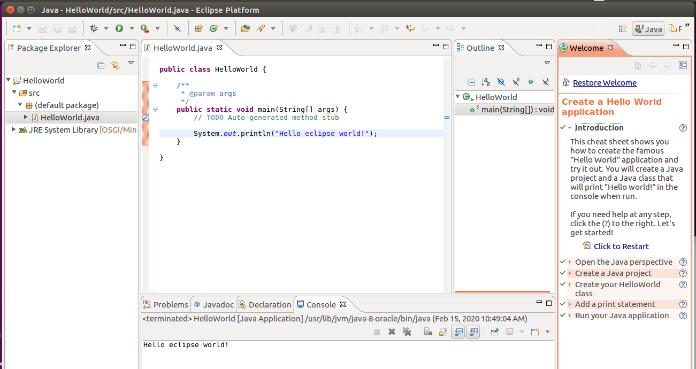

# Hello Eclipse World



## 
```
[dpitts:~/workspace/HelloEclispeWorld] # ls -aR .
.:
./  ../  bin/  .classpath  .gitignore  Hello-eclipse-world-tutorial.png  .project  README.md  .settings/  src/

./bin:
./  ../  HelloWorld.class

./.settings:
./  ../  org.eclipse.jdt.core.prefs

./src:
./  ../  HelloWorld.java
```

```
[dpitts:~/workspace/HelloEclispeWorld] # cat .settings/org.eclipse.jdt.core.prefs 
eclipse.preferences.version=1
org.eclipse.jdt.core.compiler.codegen.inlineJsrBytecode=disabled
org.eclipse.jdt.core.compiler.codegen.targetPlatform=1.2
org.eclipse.jdt.core.compiler.codegen.unusedLocal=preserve
org.eclipse.jdt.core.compiler.compliance=1.4
org.eclipse.jdt.core.compiler.debug.lineNumber=generate
org.eclipse.jdt.core.compiler.debug.localVariable=generate
org.eclipse.jdt.core.compiler.debug.sourceFile=generate
org.eclipse.jdt.core.compiler.problem.assertIdentifier=warning
org.eclipse.jdt.core.compiler.problem.enumIdentifier=warning
org.eclipse.jdt.core.compiler.source=1.3
```